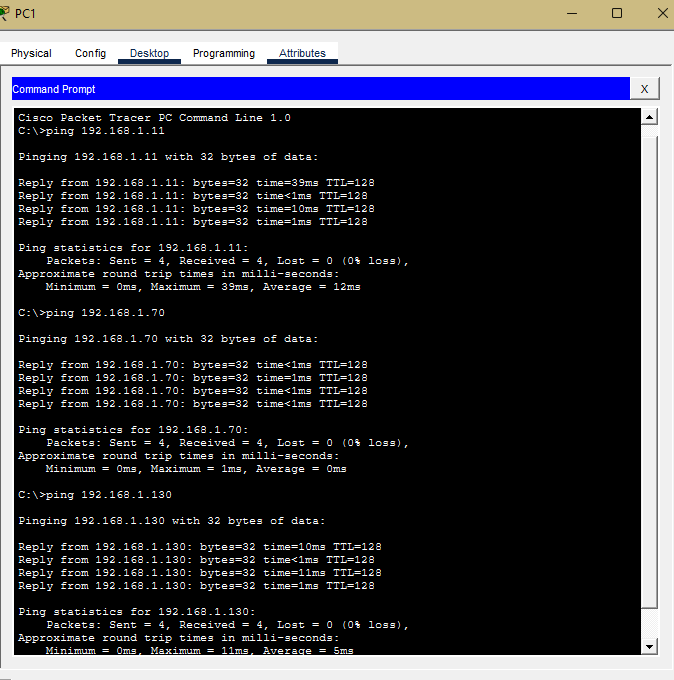

# Small Business Network Lab

## 🌐 Network Topology

## 📌 Overview
This project is a practical lab based on concepts learned in the Cisco Networking Academy course.

It demonstrates foundational networking skills including IP addressing, subnetting, VLAN segmentation, inter-VLAN routing, and network troubleshooting.

The network simulates a small business with three departments (Sales, Admin, IT), each placed in separate VLANs and subnets.

## 🎯 Skills Demonstrated
- VLAN configuration
- Subnetting and IP addressing
- Inter-VLAN routing (Router-on-a-Stick)
- Network troubleshooting (ping, tracert)
- Switch and router configuration

## 📚 Concepts Applied

- IP Addressing (IPv4)
- Subnetting (/26 networks)
- VLAN segmentation
- Inter-VLAN routing (Router-on-a-Stick)
- Default gateways
- Switching concepts
- ARP and communication between networks
- Network testing tools:
  - ping
  - tracert

  ## 🧠 What I Learned

- How devices communicate within and across networks
- How VLANs separate broadcast domains
- How routers enable communication between networks
- How to troubleshoot connectivity using ping and tracert
- How to design and document a basic network

## ⚙️ How It Works

- Each department is assigned a VLAN
- VLANs separate the network into different broadcast domains
- A trunk link connects the switch to the router
- The router uses subinterfaces to route traffic between VLANs
- Devices use default gateways to communicate across networks

## ⚙️ Configuration Files

Router and switch configurations can be found in the `/configs` folder.

The network uses VLANs and inter-VLAN routing to allow communication between departments.

---

## 🧪 Testing Results

### Ping Test: Sales to Admin

